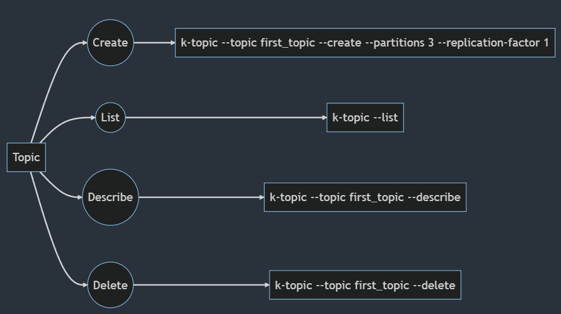
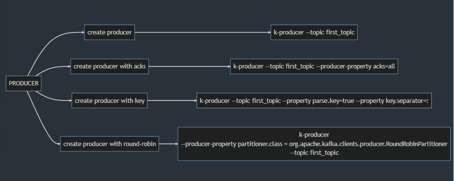
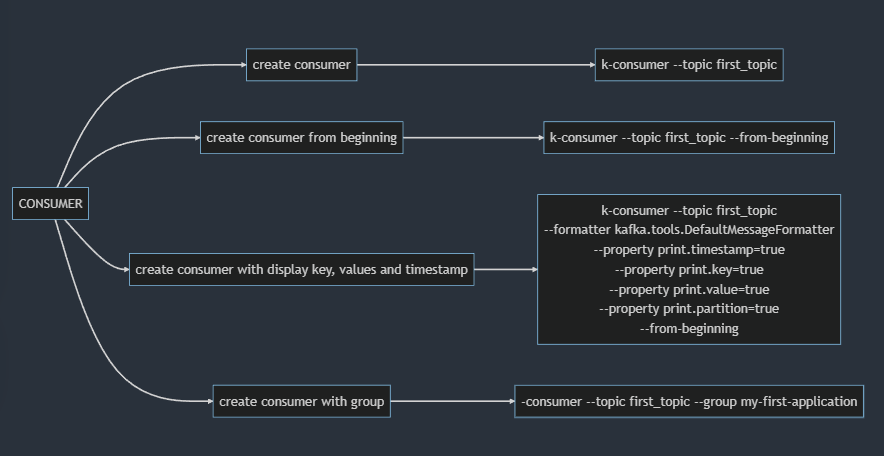

# KAFKA

### Alias a tener en cuenta:
```
alias zookeeper-start='/home/erick/kafka_2.13-3.0.0/bin/zookeeper-server-start.sh /home/erick/kafka_2.13-3.0.0/config/zookeeper.properties'
alias kafka-start='/home/erick/kafka_2.13-3.0.0/bin/kafka-server-start.sh /home/erick/kafka_2.13-3.0.0/config/server.properties'
alias k-topic='kafka-topics.sh  --bootstrap-server localhost:9092'
alias k-producer='kafka-console-producer.sh --bootstrap-server localhost:9092'
alias k-consumer='kafka-console-consumer.sh --bootstrap-server localhost:9092'
```
Resumen de comandos: [Resumen.sh](./resumen.sh)

## TOPICOS

<details>
<summary>Codigo de grafo en mermaid</summary>

```
graph LR
A[Topic] --> B((Create))
A --> C((List))
A --> D((Describe))
A --> E((Delete))
B -->F[k-topic --topic first_topic --create --partitions 3 --replication-factor 1]
C -->G[k-topic --list]
D -->H[k-topic --topic first_topic --describe]
E -->I[k-topic --topic first_topic --delete]
```
</details>



## PRODUCER

<details>
<summary>Codigo de grafo en mermaid</summary>

```
graph LR
A[PRODUCER] --> B[create producer]
A[PRODUCER] --> C[create producer with acks]
A[PRODUCER] --> D[create producer with key]
A[PRODUCER] --> E[create producer with round-robin]
B -->F[k-producer --topic first_topic]
C -->G[k-producer --topic first_topic --producer-property acks=all]
D -->H[k-producer --topic first_topic --property parse.key=true --property key.separator=:]
E -->I[k-producer 
--producer-property partitioner.class = org.apache.kafka.clients.producer.RoundRobinPartitioner 
--topic first_topic]
```

</details>



## CONSUMER

<details>
<summary>Codigo de grafo en mermaid</summary>

```
graph LR
G[CONSUMER] --> H[create consumer]
G[CONSUMER] --> I[create consumer from beginning]
G[CONSUMER] --> J[create consumer with display key, values and timestamp]
G[CONSUMER] --> K[create consumer with group]
H -->L[k-consumer --topic first_topic]
I -->M[k-consumer --topic first_topic --from-beginning]
J -->N[k-consumer --topic first_topic 
--formatter kafka.tools.DefaultMessageFormatter 
--property print.timestamp=true 
--property print.key=true 
--property print.value=true 
--property print.partition=true 
--from-beginning]
K -->O[-consumer --topic first_topic --group my-first-application]
```

</details>

